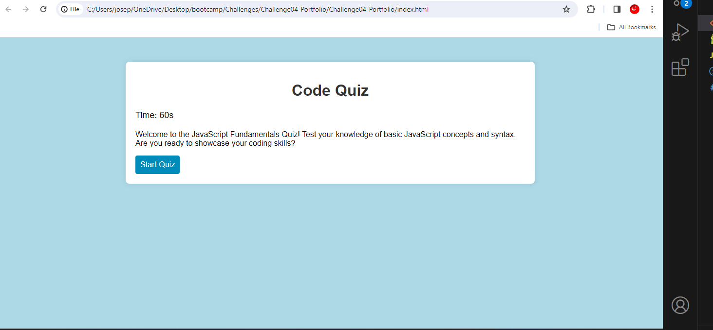
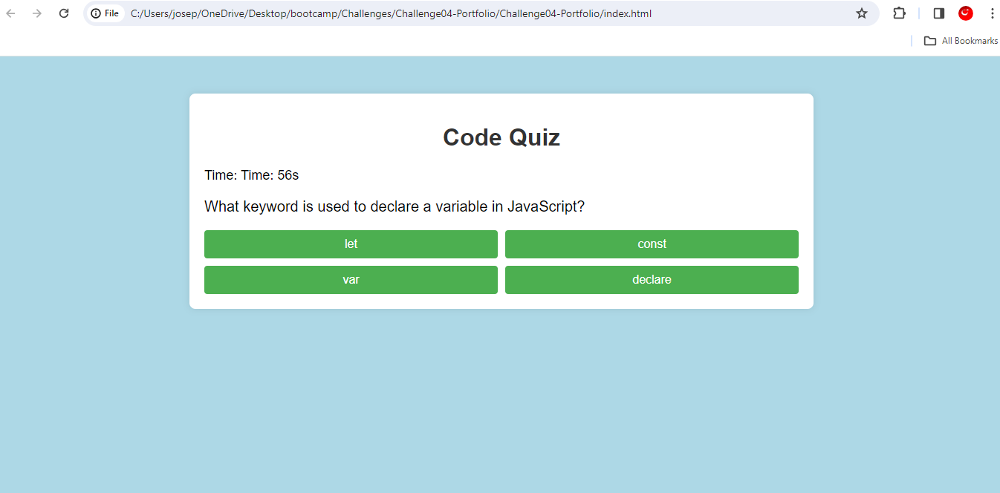
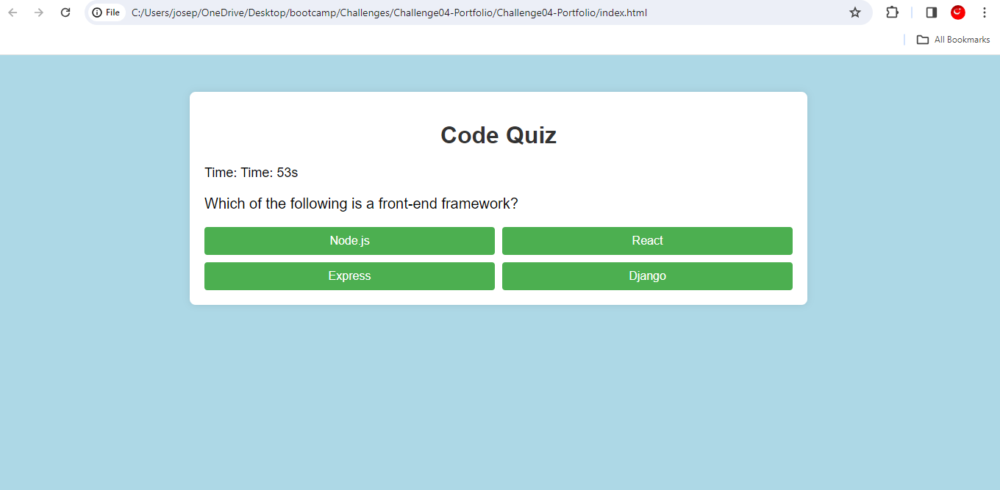
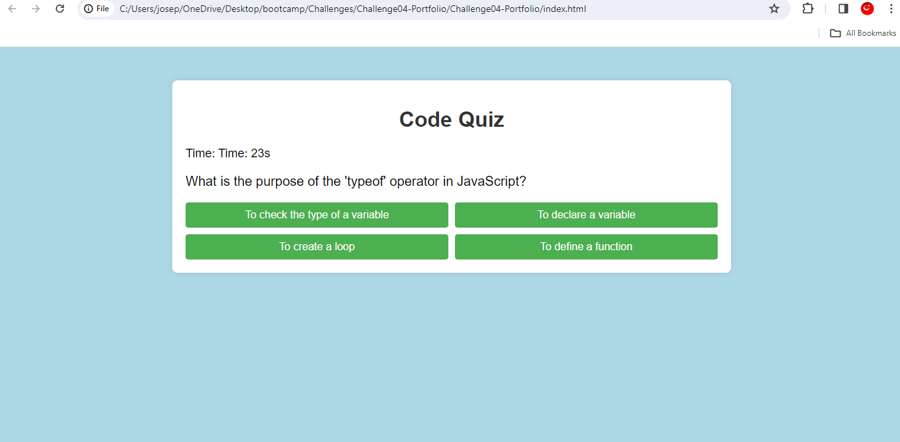
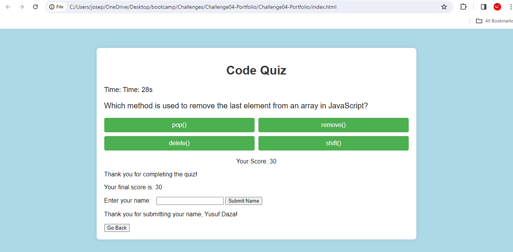

# JavaScript Fundamentals Quiz

## Description

This project is a timed coding quiz featuring multiple-choice questions on JavaScript fundamentals. The motivation behind building this project is to provide coding boot camp students with a tool to assess their understanding of JavaScript concepts and compare their scores with peers. The quiz runs in the browser, with dynamically updated HTML and CSS powered by JavaScript. It offers a clean, polished, and responsive user interface.

## Installation

N/A

## Usage

Click the "Start Quiz" button to begin the quiz. Answer each question within the given time limit. If you answer incorrectly, time is subtracted from the clock. After completing the quiz or when the timer reaches 0, the game is over. Save your initials or name and your score to compare with others.

## Live Link

[JavaScript Fundamental Quiz](https://yusufdaza.github.io/Challenge04-Portfolio/)

## Credits

- [Joseph Daza]

Feel free to customize this section with any additional collaborators, third-party assets, or tutorials you utilized.

## License

The last section of a high-quality README file is the license. This project is open-source, and you can find the license details in the [LICENSE](LICENSE) file.

---

## Badges

Badges aren't necessary, but they demonstrate street cred. Check out the badges hosted by [shields.io](https://shields.io/).

## Features

- Timed coding quiz with multiple-choice questions.
- Dynamic presentation of questions and answers.
- High score storage for progress tracking.
- Responsive and polished user interface.

## How to Contribute

If you have ideas or improvements, feel free to contribute. Please follow the [Contributor Covenant](https://www.contributor-covenant.org/).

